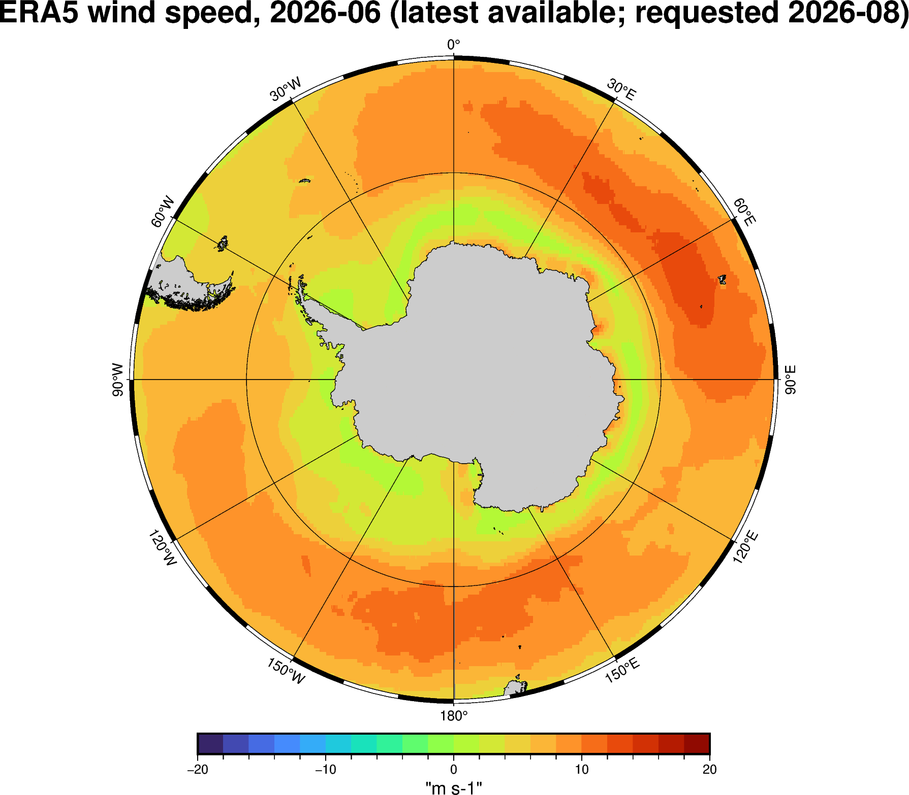
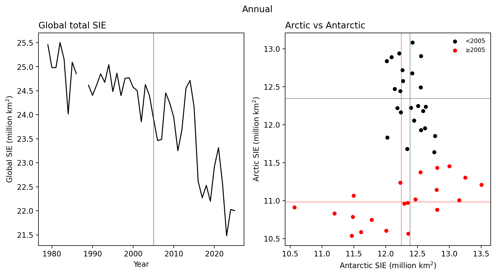
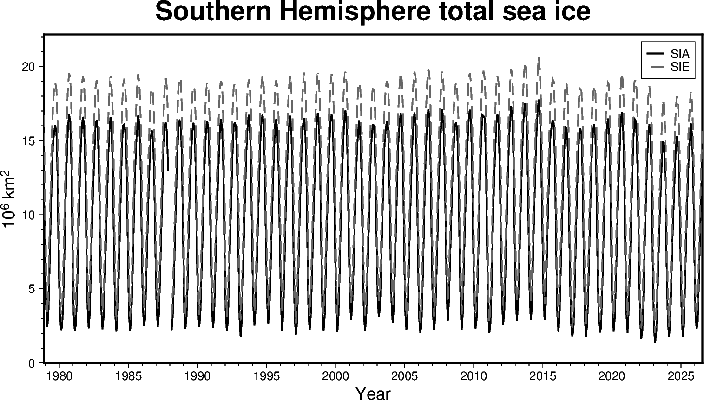
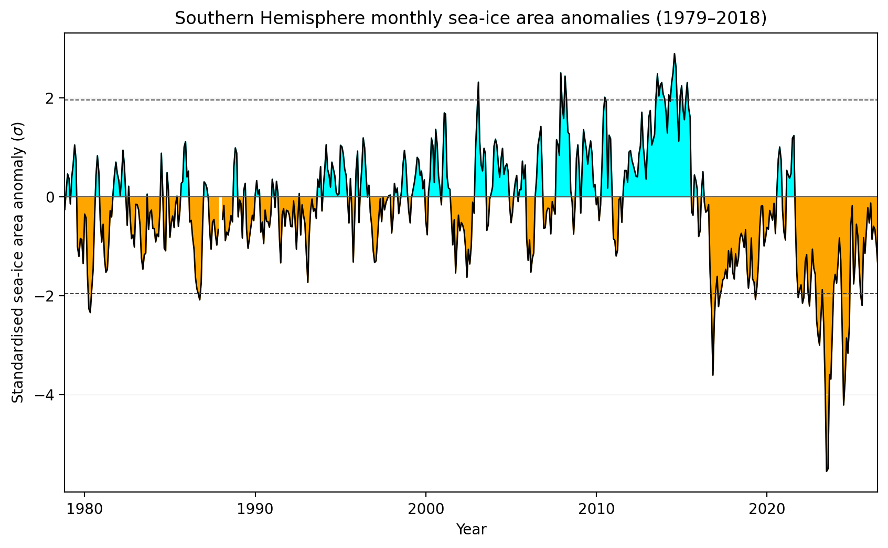

# Monthly Sea Ice Science Chat Figures

Last refreshed: 2026-09-16T13:09:32

Figure directory: `/g/data/gv90/da1339/src/mawsons-chest/floes/figs/mthly_sea_ice_sci_chat`

## ERA5 wind SIE SH 202512

## ERA5 wind SIE SH 202606

## ERA5 wind SIE SH 202608

## NSIDC Arctic vs Antarctic annual

## NSIDC Arctic vs Antarctic monthly anomalies

## NSIDC SH sic anomaly 202604

## NSIDC SH sic anomaly 202605

## NSIDC SH sic anomaly 202607

## NSIDC SH total SIA SIE monthly

## NSIDC SIA cdr monthly tplot absolute

## NSIDC SIA cdr monthly tplot standardised

## NSIDC SIE cdr monthly anoms byyear

## NSIDC SIEmax vs day-of-max

## OISST global sst anomaly 202604

## OISST global sst anomaly 202607

