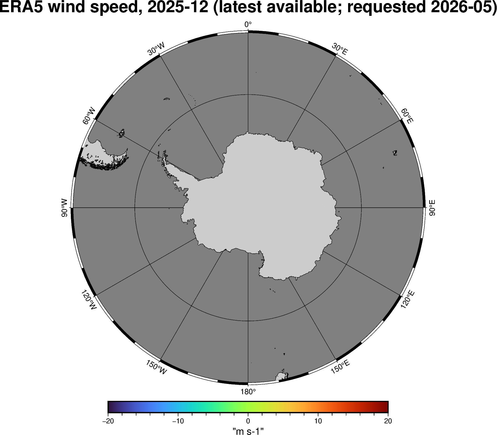
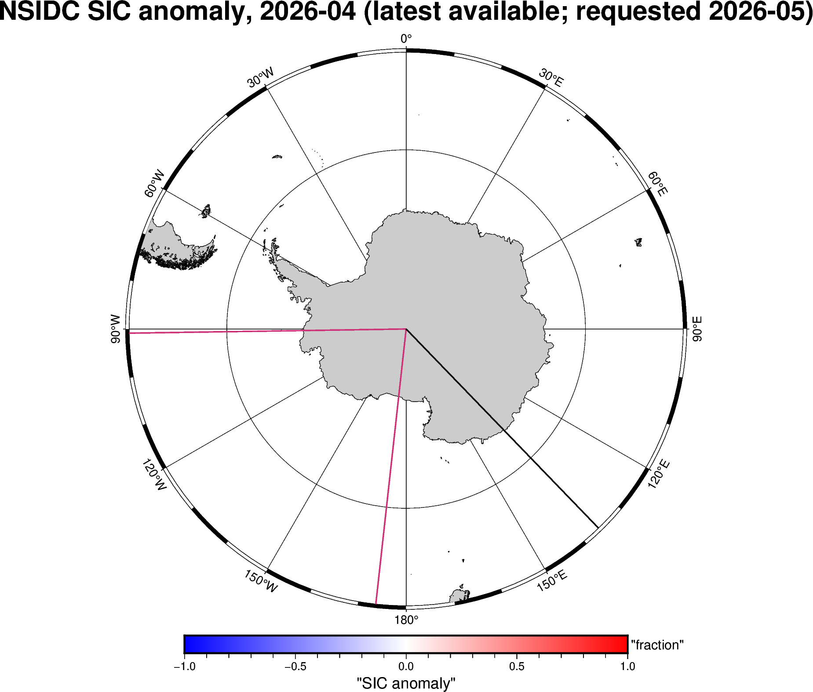
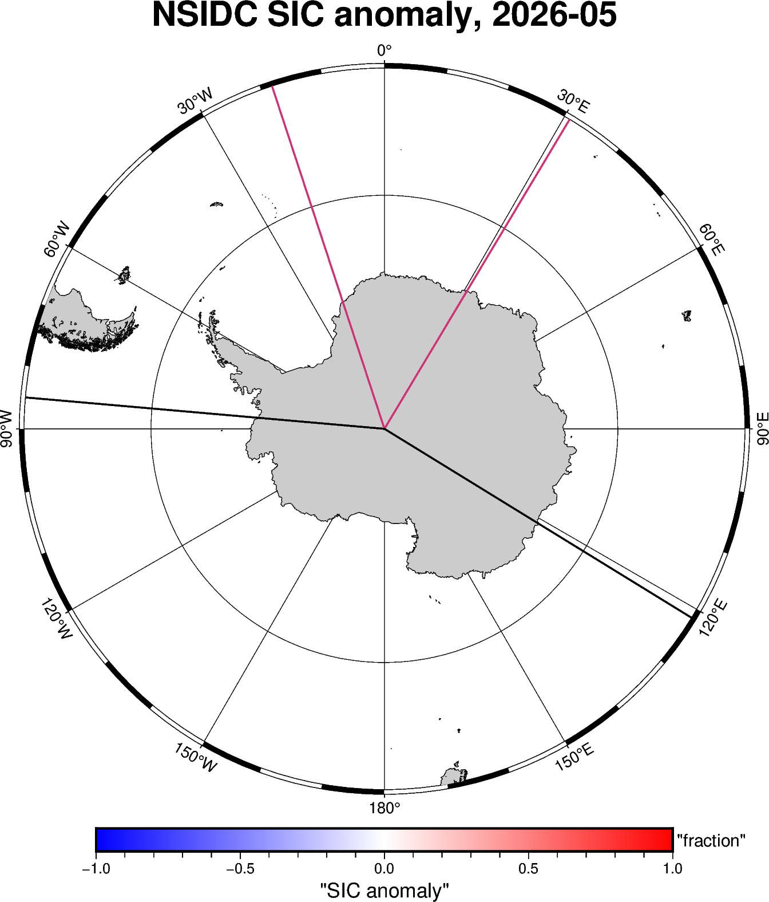
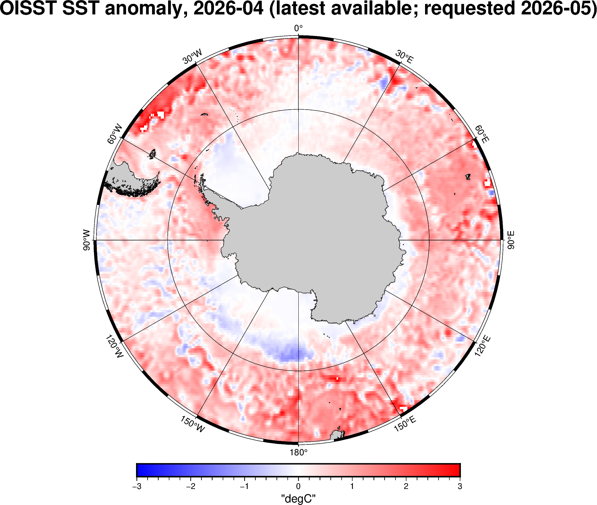

# Monthly Sea Ice Science Chat Figures

Last refreshed: 2026-06-16T07:42:04

Figure directory: `/g/data/gv90/da1339/src/mawsons-chest/floes/figs/mthly_sea_ice_sci_chat`

## ERA5 wind SIE SH 202512

## NSIDC SH sic anomaly 202604

## NSIDC SH sic anomaly 202605

## OISST global sst anomaly 202604

