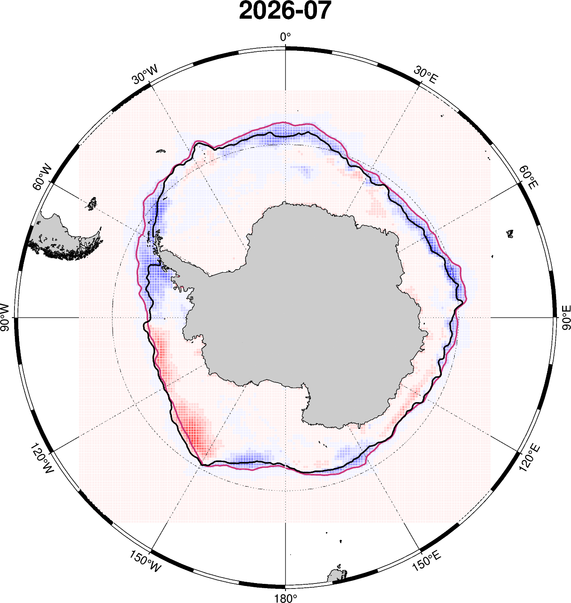
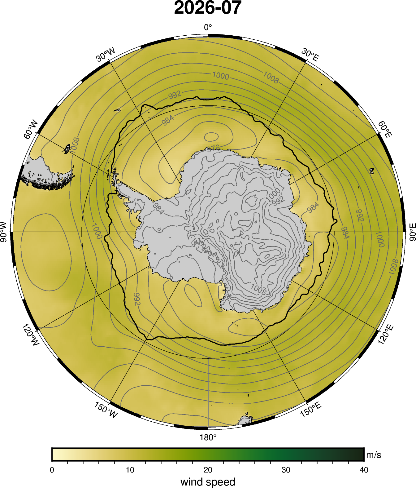

# Monthly Sea Ice Science Chat Figures

Last refreshed: 2026-09-19T06:06:42

Figure directory: `/g/data/gv90/da1339/src/mawsons-chest/floes/figs/mthly_sea_ice_sci_chat`

## NSIDC SH sic anomaly — 2026-07

## ESA CCI L3C SH monthly SIT — 2024-04

*Monthly gridded L3C sea-ice thickness; black line is the matching-month NSIDC 15% SIC edge.*

## OISST global SST anomaly and observed SIE — 2026-07

*Black edge is NSIDC and dashed orange edge is University of Bremen AMSR2, both at 15% SIC.*

## ERA5 wind speed, MSLP and observed SIE — 2026-07

*Black edge is NSIDC and dashed orange edge is University of Bremen AMSR2, both at 15% SIC.*
