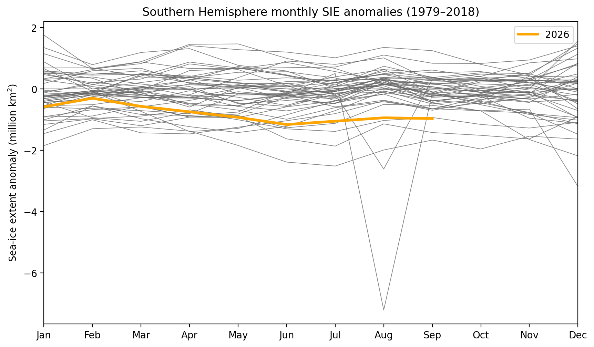
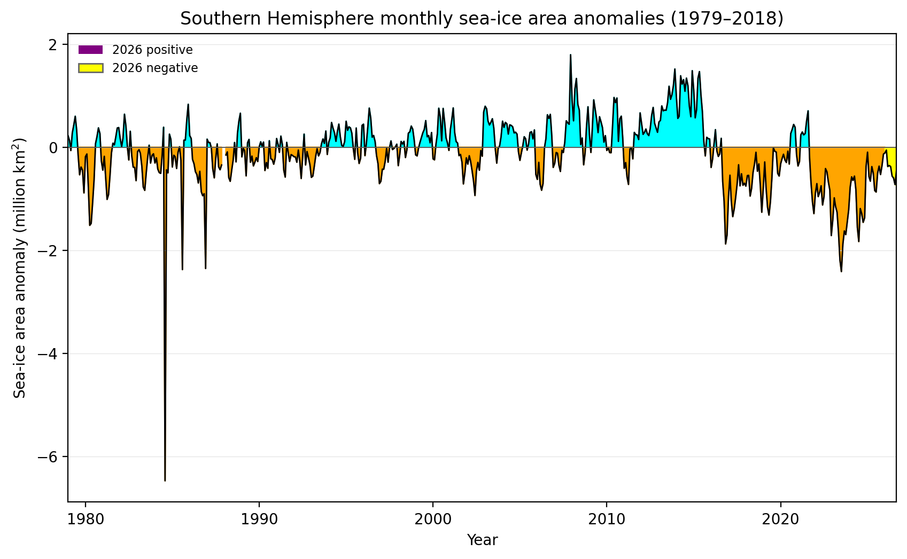

# Monthly Sea Ice Science Chat Figures

Last refreshed: 2026-09-19T13:18:25

Figure directory: `/g/data/gv90/da1339/src/mawsons-chest/floes/figs/mthly_sea_ice_sci_chat`

## NSIDC SIE cdr monthly anoms byyear

## NSIDC SIA cdr monthly tplot absolute

## NSIDC SH sic anomaly — 2026-08

## University of Bremen AMSR2 SH SIC and SIE — 2026-08

*Monthly-mean ASI-AMSR2 SIC; black edge is NSIDC and dashed orange edge is Bremen, both at 15% SIC.*

## ESA CCI L3C SH monthly SIT — 2024-04

*Monthly gridded L3C sea-ice thickness; black line is the matching-month NSIDC 15% SIC edge.*

## OISST global SST anomaly and observed SIE — 2026-07

*Black edge is NSIDC and dashed orange edge is University of Bremen AMSR2, both at 15% SIC.*

## ERA5 wind speed, MSLP and observed SIE — 2026-08

*Black edge is NSIDC and dashed orange edge is University of Bremen AMSR2, both at 15% SIC.*

## NSIDC SIEmax vs day-of-max

## NSIDC Arctic vs Antarctic monthly anomalies

The left panel shows the combined Arctic and Antarctic monthly SIE anomaly: values below zero mean global sea-ice extent was below its calendar-month climatology. In the right panel, each point is one month; the lower-left quadrant means both hemispheres were below average, while the opposite-sign quadrants show compensation between hemispheres. Black denotes months before 2005; red denotes 2005 onward.

*Constructed from separate Arctic and Antarctic calendar-month anomalies relative to the 1979–2018 NSIDC climatology; the hemispheric anomalies are summed for the global series.*
