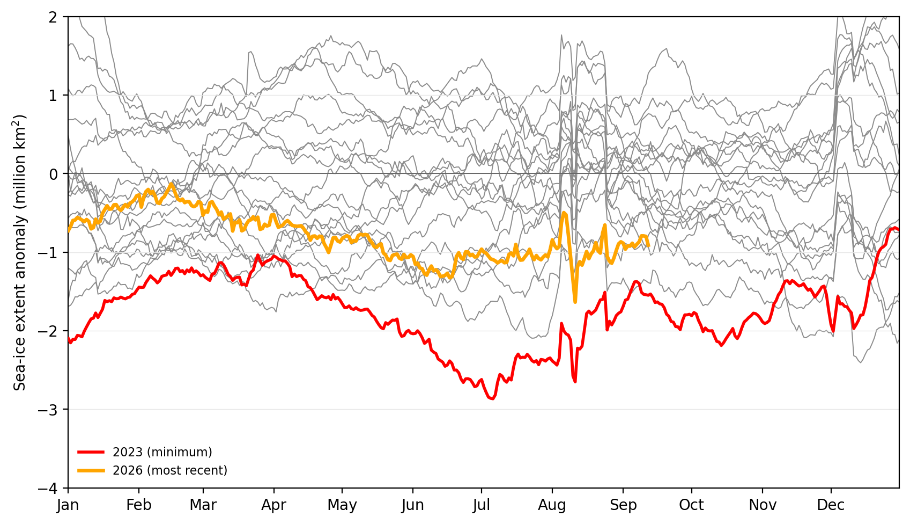
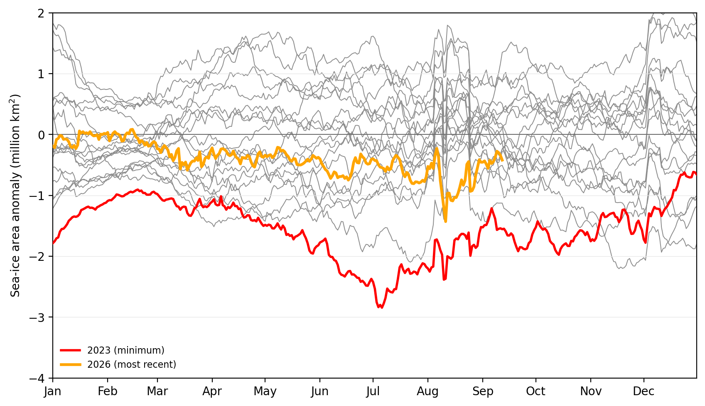
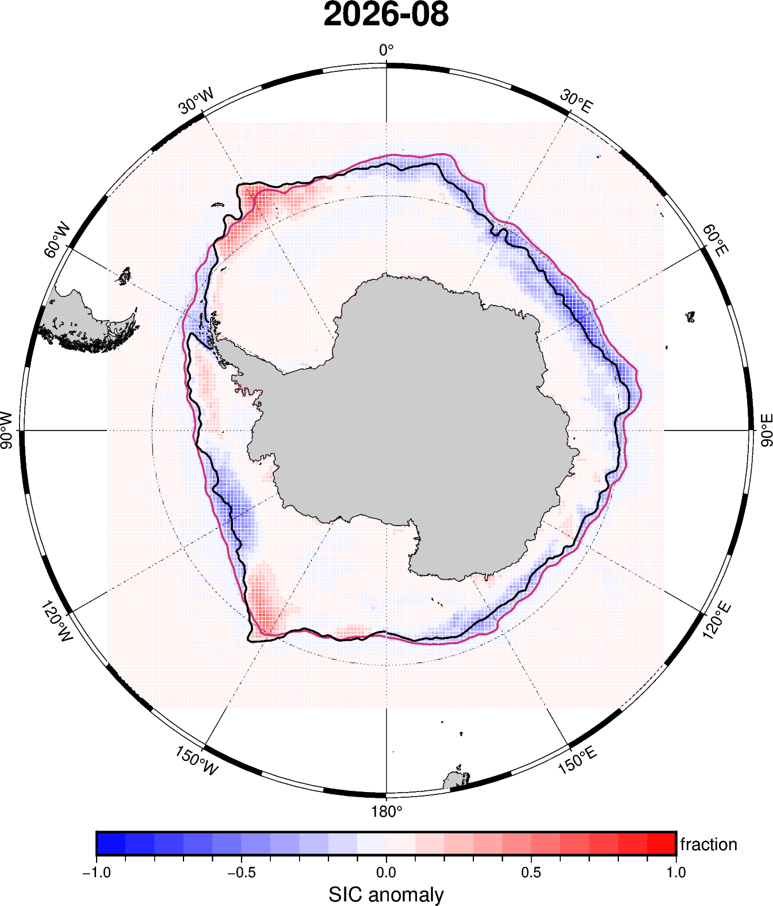
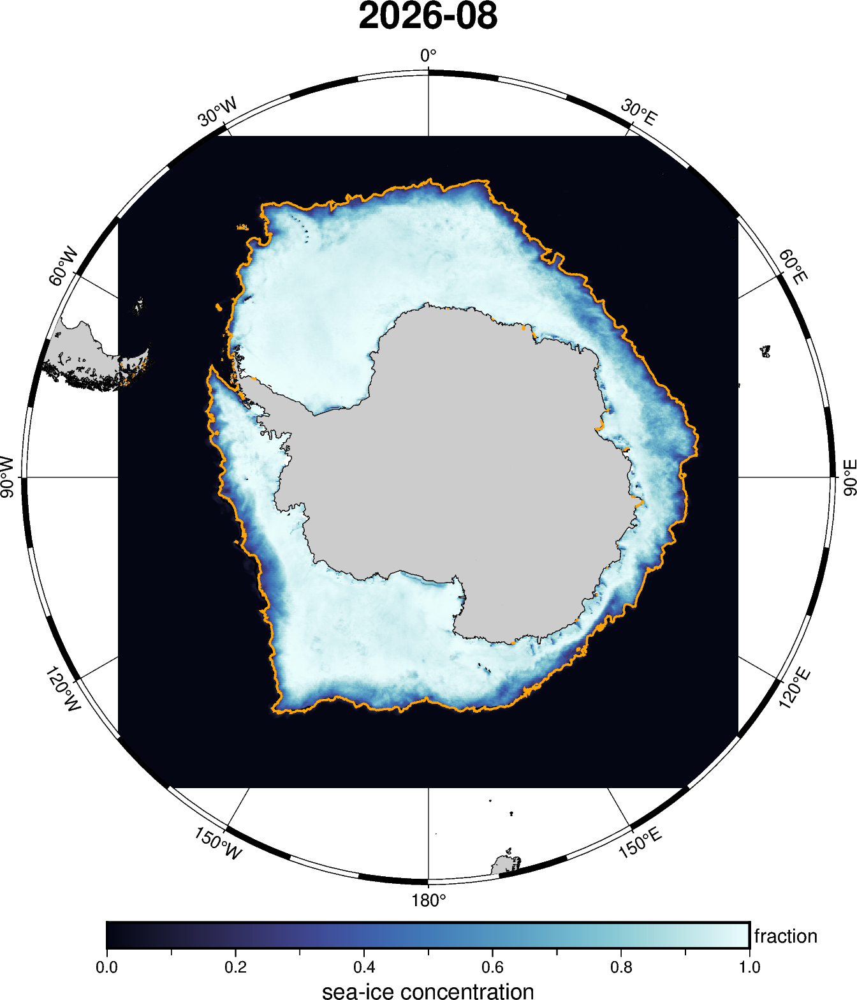
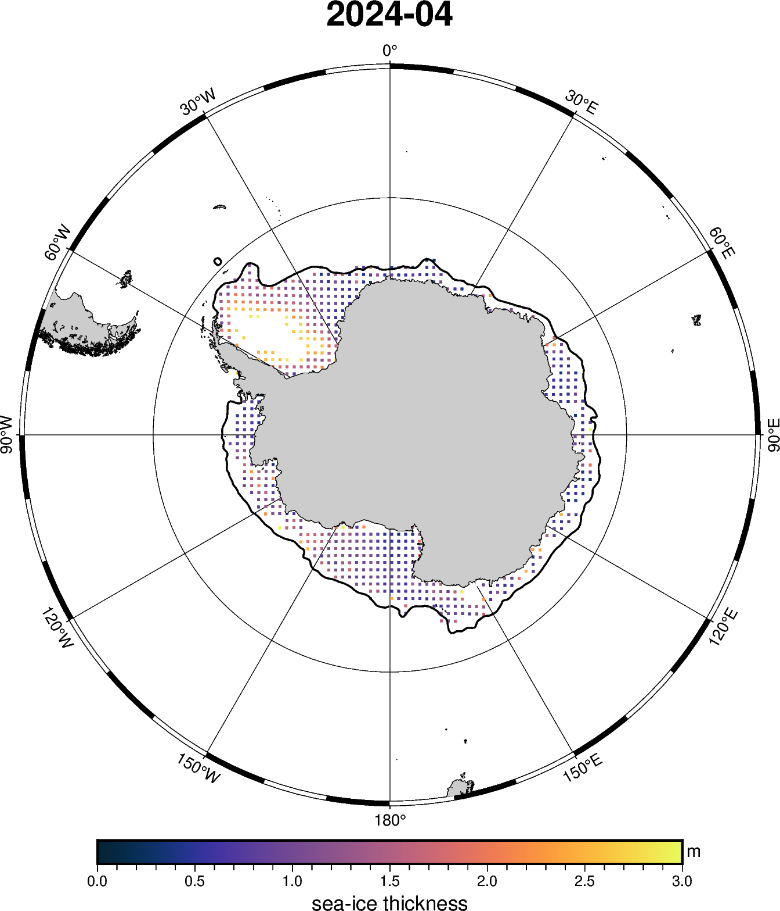
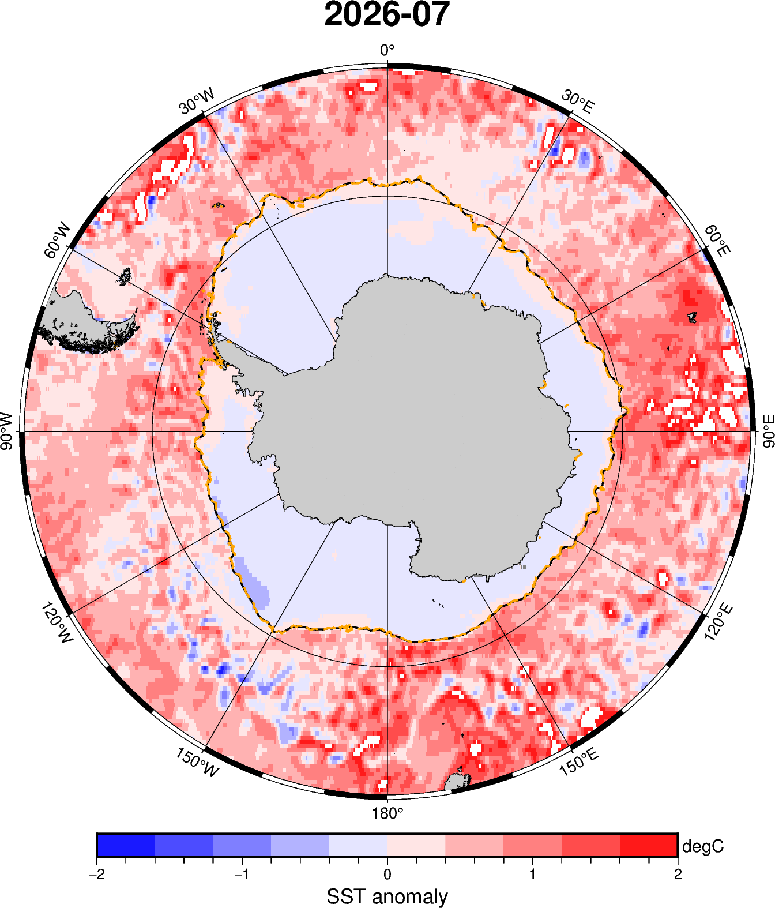
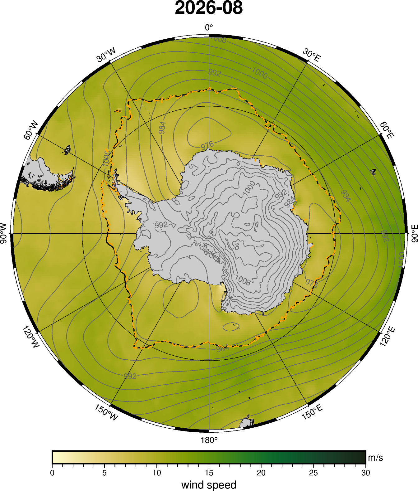
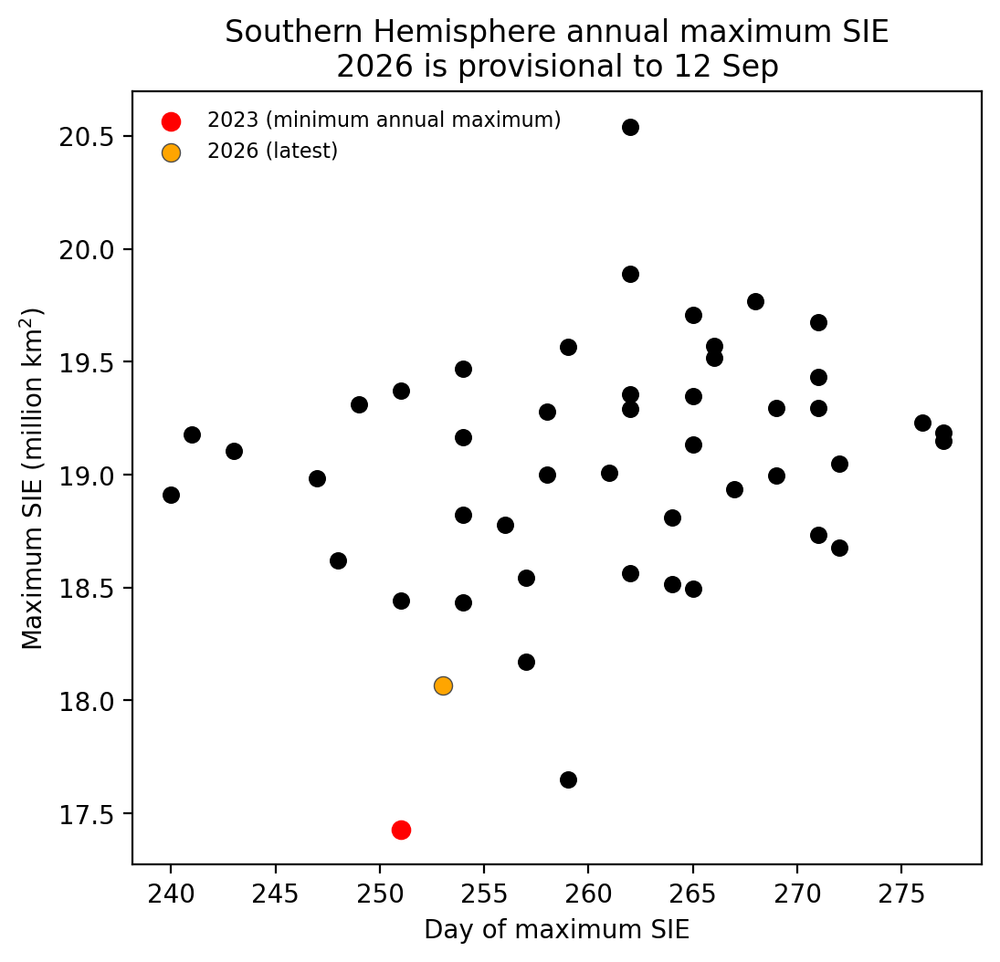
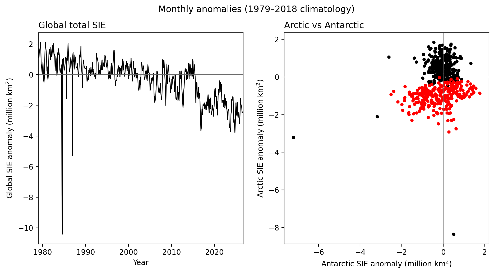

# Monthly Sea Ice Science Chat Figures

Last refreshed: 2026-09-19T15:43:13

Figure directory: `/g/data/gv90/da1339/src/mawsons-chest/floes/figs/mthly_sea_ice_sci_chat`

## Daily Southern Hemisphere SIE Anomalies

*Daily NSIDC G02202 V6 SIE anomalies relative to the 1979–2018 40-year calendar-day climatology (29 February omitted). The most recent 20 years are shown; the year with the lowest daily anomaly is red and the most recent year is orange.*

## Daily Southern Hemisphere SIA Anomalies

*Daily NSIDC G02202 V6 SIA anomalies relative to the 1979–2018 40-year calendar-day climatology (29 February omitted). The most recent 20 years are shown; the year with the lowest daily anomaly is red and the most recent year is orange.*

## NSIDC SH SIC anomaly — 2026-08

*Monthly-mean NSIDC G02202 V6 SIC anomaly relative to the 1979–2008 climatology. Positive colours indicate greater-than-climatological concentration and negative colours less ice. The black contour is the selected month's 15% SIC edge; the magenta contour is the climatological 15% SIC edge for the same calendar month.*

**Rolling three-month / three-year archive**

| Year | 05 | 06 | 07 |
| --- | --- | --- | --- |
| 2024 | [2024-05](../figs/mthly_sea_ice_sci_chat/NSIDC_SH_sic_anomaly_202405.png) | [2024-06](../figs/mthly_sea_ice_sci_chat/NSIDC_SH_sic_anomaly_202406.png) | [2024-07](../figs/mthly_sea_ice_sci_chat/NSIDC_SH_sic_anomaly_202407.png) |
| 2025 | [2025-05](../figs/mthly_sea_ice_sci_chat/NSIDC_SH_sic_anomaly_202505.png) | [2025-06](../figs/mthly_sea_ice_sci_chat/NSIDC_SH_sic_anomaly_202506.png) | [2025-07](../figs/mthly_sea_ice_sci_chat/NSIDC_SH_sic_anomaly_202507.png) |
| 2026 | [2026-05](../figs/mthly_sea_ice_sci_chat/NSIDC_SH_sic_anomaly_202605.png) | [2026-06](../figs/mthly_sea_ice_sci_chat/NSIDC_SH_sic_anomaly_202606.png) | [2026-07](../figs/mthly_sea_ice_sci_chat/NSIDC_SH_sic_anomaly_202607.png) |

## University of Bremen AMSR2 SH SIC and SIE — 2026-08

*Monthly-mean University of Bremen ASI-AMSR2 SIC at 6.25 km. The black contour is the NSIDC G02202 V6 15% SIC edge and the solid orange contour is the Bremen 15% edge. This independent, higher-resolution AMSR2 retrieval is retained alongside NSIDC to expose edge sensitivity to sensor, retrieval method and spatial resolution rather than relying on a single sea-ice product.*

**Rolling three-month / three-year archive**

| Year | 05 | 06 | 07 |
| --- | --- | --- | --- |
| 2024 | — | — | — |
| 2025 | — | — | — |
| 2026 | [2026-05](../figs/mthly_sea_ice_sci_chat/BREMEN_AMSR2_SH_sic_SIE_202605.png) | [2026-06](../figs/mthly_sea_ice_sci_chat/BREMEN_AMSR2_SH_sic_SIE_202606.png) | [2026-07](../figs/mthly_sea_ice_sci_chat/BREMEN_AMSR2_SH_sic_SIE_202607.png) |

## ESA CCI L3C SH monthly SIT — 2024-04

*Latest locally available ESA CCI v4.0 L3C monthly sea-ice thickness, averaging available sensor fields on their common grid where more than one sensor contributes. The black contour is the matching-month NSIDC 15% SIC edge.*

**Rolling three-month / three-year archive**

| Year | 01 | 02 | 03 |
| --- | --- | --- | --- |
| 2022 | [2022-01](../figs/mthly_sea_ice_sci_chat/ESA_CCI_L3C_SH_sit_202201.png) | [2022-02](../figs/mthly_sea_ice_sci_chat/ESA_CCI_L3C_SH_sit_202202.png) | [2022-03](../figs/mthly_sea_ice_sci_chat/ESA_CCI_L3C_SH_sit_202203.png) |
| 2023 | [2023-01](../figs/mthly_sea_ice_sci_chat/ESA_CCI_L3C_SH_sit_202301.png) | [2023-02](../figs/mthly_sea_ice_sci_chat/ESA_CCI_L3C_SH_sit_202302.png) | [2023-03](../figs/mthly_sea_ice_sci_chat/ESA_CCI_L3C_SH_sit_202303.png) |
| 2024 | [2024-01](../figs/mthly_sea_ice_sci_chat/ESA_CCI_L3C_SH_sit_202401.png) | [2024-02](../figs/mthly_sea_ice_sci_chat/ESA_CCI_L3C_SH_sit_202402.png) | [2024-03](../figs/mthly_sea_ice_sci_chat/ESA_CCI_L3C_SH_sit_202403.png) |

## OISST global SST anomaly and observed SIE — 2026-07

*Floes forms the monthly SST anomaly from NOAA OISST v2.1 relative to the 1979–2008 monthly climatology. OISST blends bias-adjusted satellite SST with ships, buoys and Argo on a 0.25° daily grid and fills gaps by optimum interpolation; in the marginal ice zone, sea-ice concentration supplies proxy SST where direct observations are sparse. Black is the NSIDC 15% SIC edge and dashed orange is Bremen. [NOAA OISST methodology](https://www.ncei.noaa.gov/products/optimum-interpolation-sst).*

## ERA5 wind speed, MSLP and observed SIE — 2026-08

*Monthly-mean ERA5 10 m wind speed is calculated from the u10 and v10 components and plotted from 0–30 m s⁻¹; mean sea-level pressure is overlaid as hPa contours. Black is the NSIDC 15% SIC edge and dashed orange is the Bremen edge, providing atmospheric context for the observed sea-ice state.*

**Rolling three-month / three-year archive**

| Year | 05 | 06 | 07 |
| --- | --- | --- | --- |
| 2024 | [2024-05](../figs/mthly_sea_ice_sci_chat/ERA5_wind_SIE_SH_202405.png) | [2024-06](../figs/mthly_sea_ice_sci_chat/ERA5_wind_SIE_SH_202406.png) | [2024-07](../figs/mthly_sea_ice_sci_chat/ERA5_wind_SIE_SH_202407.png) |
| 2025 | [2025-05](../figs/mthly_sea_ice_sci_chat/ERA5_wind_SIE_SH_202505.png) | [2025-06](../figs/mthly_sea_ice_sci_chat/ERA5_wind_SIE_SH_202506.png) | [2025-07](../figs/mthly_sea_ice_sci_chat/ERA5_wind_SIE_SH_202507.png) |
| 2026 | [2026-05](../figs/mthly_sea_ice_sci_chat/ERA5_wind_SIE_SH_202605.png) | [2026-06](../figs/mthly_sea_ice_sci_chat/ERA5_wind_SIE_SH_202606.png) | [2026-07](../figs/mthly_sea_ice_sci_chat/ERA5_wind_SIE_SH_202607.png) |

## NSIDC SIEmax vs day-of-max

*Annual Southern Hemisphere SIE maxima are derived from daily NSIDC G02202 V6 SIE after a centred five-day running mean over August–October. Red marks the year with the lowest annual maximum; orange marks the latest year with an available maximum.*

## NSIDC Arctic vs Antarctic monthly anomalies

The left panel shows the combined Arctic and Antarctic monthly SIE anomaly: values below zero mean global sea-ice extent was below its calendar-month climatology. In the right panel, each point is one month; the lower-left quadrant means both hemispheres were below average, while the opposite-sign quadrants show compensation between hemispheres. Black denotes months before 2005; red denotes 2005 onward.

*Constructed from separate Arctic and Antarctic calendar-month anomalies relative to the 1979–2018 NSIDC climatology; the hemispheric anomalies are summed for the global series.*
